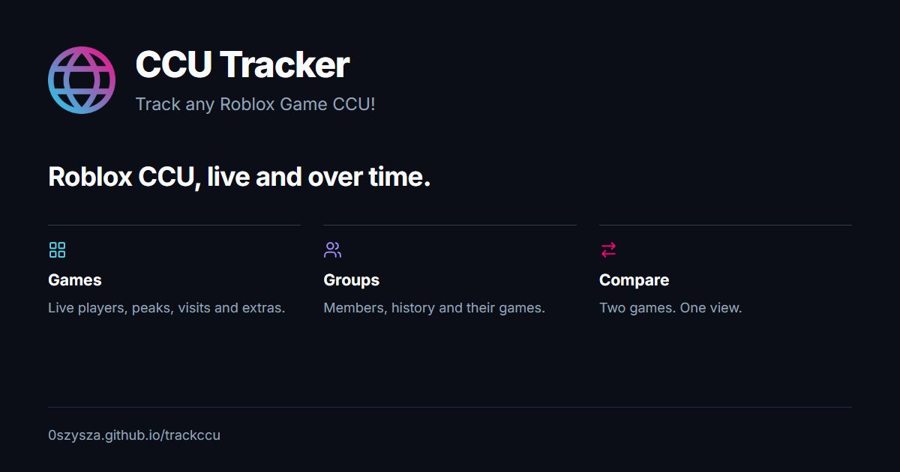

# CCU Tracker

Roblox player counts, group members and their history in one place.

**[Open the tracker](https://0szysza.github.io/trackccu/)** · [Games](https://0szysza.github.io/trackccu/games) · [Groups](https://0szysza.github.io/trackccu/groups) · [Compare](https://0szysza.github.io/trackccu/compare)

## Features

### Games

| Feature | What it does |
| --- | --- |
| Game discovery | Search the tracked catalog by name and reverse the player-count ranking. A Roblox game link or place ID can open a lookup for an untracked game. |
| Live overview | Current CCU, one-hour and 24-hour changes, ratings, visits, favorites and recent peaks. |
| Dedicated game pages | Game icon and thumbnail, creator links, description, game metadata, tracking start and links back to Roblox. |
| Historical charts | Switch between players, favorites and visits across **1D**, **7D** and **All** available history. |
| Interactive history | Inspect points for exact timestamps and values; move or resize the history navigator; use fullscreen for a larger chart. |
| Peak records | Recorded player peaks for the last 24 hours, 7 days and 30 days, including when they occurred. |
| Passes and products | Search game extras; inspect price, description, artwork, creation/update dates and recorded price history where available. |
| Badges | Search badges and open their details, award totals, rarity, availability and dates where Roblox supplies them. |
| Roblox events | Browse current/upcoming and past events, open their details, inspect status, dates and interested counts, and follow the Roblox link. |

### Groups

| Feature | What it does |
| --- | --- |
| Group discovery | Search tracked groups, reverse the member-count ranking, or look up a Roblox community link/group ID. |
| Member overview | Current membership, one-hour and 24-hour changes, owner information and verification badges where available. |
| Group history | Chart members or the group’s total players across **1D**, **7D** and **All**. |
| Interactive charts | Point inspection, high/low/average summaries, a draggable time navigator and fullscreen. |
| Group totals | Visits, favorites and players across the relevant group games; unavailable data remains marked as unavailable. |
| Created games | Open the group’s games already included in the tracker. |
| Group details | Description, tracking information and direct links to the Roblox community and owner. |

### Compare

- Pick two tracked games with searchable selectors, and replace or remove either selection.
- Compare current players, 24-hour/7-day peaks, visits and favorites side by side.
- Plot both games’ player histories on one chart.
- Switch between **Players** and **Share**. Share means each game’s percentage of the two selected games’ combined players.
- Use **1D**, **7D** or **All**, inspect points, adjust the time navigator, review period summaries and open fullscreen.

### Across the site

- Home-page totals and ranked strips of tracked games and groups.
- An update indicator showing the age of the latest published data.
- Responsive layouts, including two-column passes/products/badges on phones.
- Shared Games / Groups / Compare navigation, a Tools dropdown and a back arrow to the [tool hub](https://0szysza.github.io/).
- Discord/social link previews with page-specific titles, descriptions and PNG cover images.

## Data and refreshes

CCU means **concurrent users**: the number of players currently in a game.

The collection/deployment workflow is triggered approximately every five minutes by an external repository dispatch, and also runs after pushes or a manual dispatch. Roblox data, runner queues and publication time can delay a visible update; the header shows the latest published reading.

Game and group history is retained for up to **90 days**. **All** means the available recorded history, not a game’s entire lifetime. New entries start accumulating history when tracking begins. Longer ranges may aggregate readings.

Passes, developer products and badges are refreshed approximately hourly. Price history begins with observed prices. Events combine Roblox data with the maintained archive. Missing fields are shown as unavailable rather than fabricated.

Untracked lookups use public Roblox-compatible proxy endpoints. They show current details and do not automatically add an item to the recorded catalog.

An optional hourly Discord digest is supported by the collector when the repository’s `DISCORD_WEBHOOK_URL` secret is configured. The credential stays in GitHub Actions, not in the public website.

## Development

The production site is static HTML/CSS/JavaScript served by GitHub Pages. Node.js 22 is used for page generation and collection. The repository also contains optional Netlify/database code; the current Pages deployment reads generated JSON files instead.

### Run a local static preview

~~~powershell
New-Item -ItemType Directory -Force _site/assets
Copy-Item index.html,404.html,games.html,groups.html,compare.html,lookup.html,lookup.js,group-lookup.html,group-lookup.js,site.js,group-page.js,site.css,tailwind-config.js,rebirth-logo.svg,favicon.ico,favicon.png,favicon-32.png,apple-touch-icon.png _site
Copy-Item assets/* _site/assets -Recurse -Force
Copy-Item scripts/config.static.js _site/config.js
$env:OUT_DIR = (Join-Path (Get-Location) "_site")
$env:SITE_URL = "https://0szysza.github.io/trackccu"
node scripts/sync-games.mjs
node scripts/collect.mjs
node scripts/collect-groups.mjs
node scripts/collect-extras.mjs
python -m http.server 8000 --directory _site
~~~

Open [localhost:8000](http://localhost:8000/). The collectors need network access. Keep the optional Discord webhook environment variable unset when previewing data locally.

### Add a tracked game or group

1. Add a game to `scripts/games.json` using a unique slug, place ID, name and short label. Creator details and a universe ID are optional.
2. Add a group’s ID and name to `scripts/groups.json`.
3. Push to `main`. The workflow updates the catalogs and creates the game/group pages from their templates.

Edit `scripts/game-template.html` or `scripts/group-template.html` for shared detail-page changes. Generated pages are rebuilt on deployment, so their Open Graph metadata is kept in the templates and their URLs are filled by `scripts/sync-games.mjs`.

### Repository map

| Path | Purpose |
| --- | --- |
| `index.html`, `games.html`, `groups.html`, `compare.html` | Main screens. |
| `site.js` / `site.css` | Shared data helpers, navigation and styles. |
| `group-page.js` | Group statistics and charts. |
| `lookup*.html/js` and `group-lookup.html/js` | Untracked game/group lookup views. |
| `scripts/*-template.html` / `scripts/sync-games.mjs` | Generated detail pages, catalog synchronization and cache versions. |
| `scripts/collect*.mjs` | Game, group and extras collection. |
| `assets/social/` | Share-card PNGs and their editable HTML source. |
| `.github/workflows/update.yml` | Assemble, collect and publish the Pages site. |

## Sharing

Every main page and generated game/group page includes static Open Graph and Twitter Card tags. Crawlers can read them without running JavaScript. Cover images use absolute HTTPS URLs and are **1200 × 630 PNGs**.

Edit `assets/social/card.html` to update the card artwork; capture it at 1200 × 630 as `cover.png` or the Games/Groups/Compare variant. Replace the PNG and update its version in the metadata when changing the artwork. Platforms may cache existing link previews.

## Related tools

- [BGSI Rebirth Calculator](https://0szysza.github.io/rebirth/) — estimate rebirth progress and finish times.
- [0szysza tool hub](https://0szysza.github.io/) — choose a tool.

## About

Built by [0szysza](https://github.com/0szysza). This is an independent project, not affiliated with Roblox or the creators of the tracked games.
